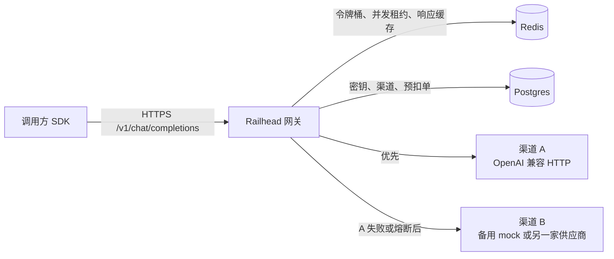
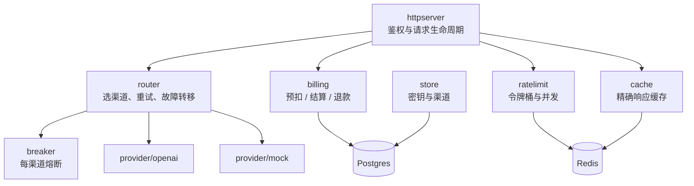
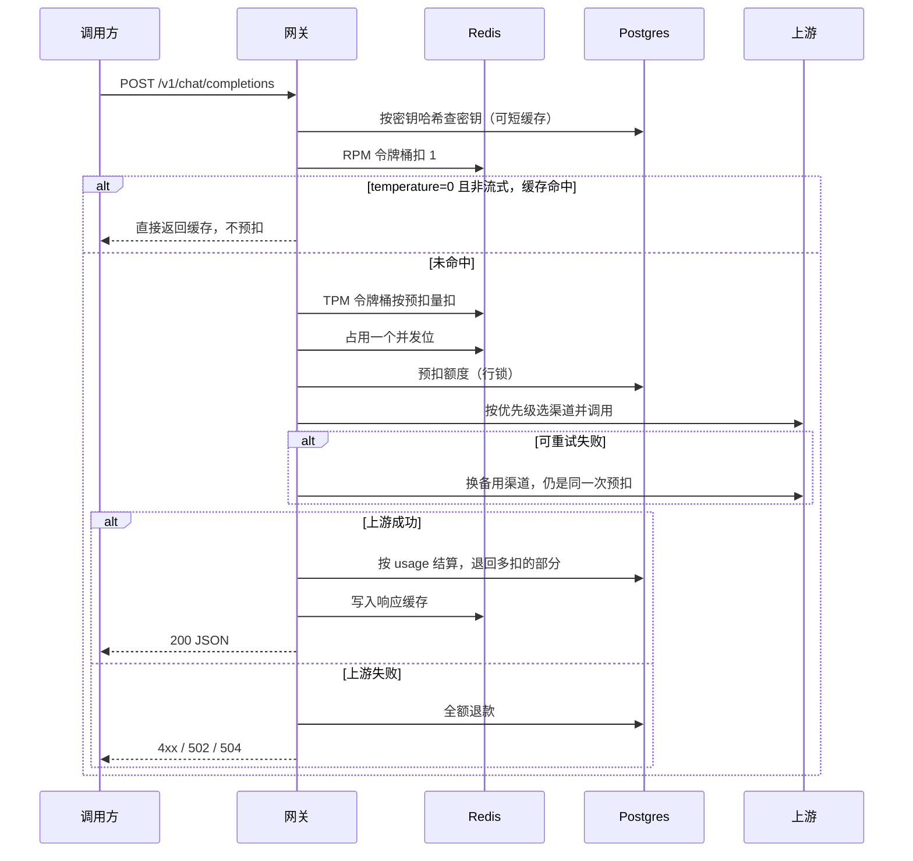
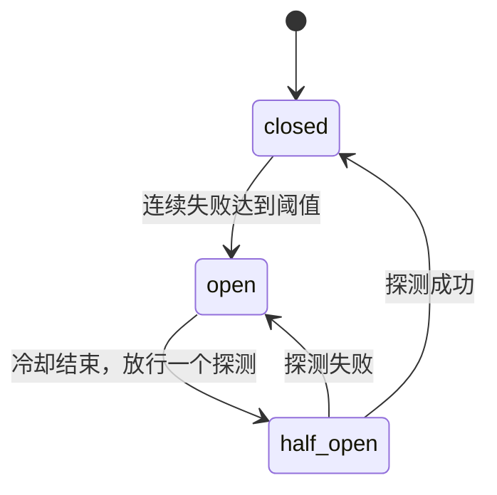

# Railhead 设计说明

Railhead 是一家 SaaS 公司内部 AI 能力平台的模型接入层。客服、文档、代码助手等业务线共用这一层：调用方使用各自的 API Key 访问 OpenAI Chat Completions，网关按密钥做额度与计费、限流，并在多个模型供应商之间自动故障转移。上游可以是官方 OpenAI、DeepSeek、vLLM、Ollama，也可以是本仓库自带的 mock。

同一条请求路径上处理限流、熔断、重试、流式转发，以及并发下额度不能超扣。实现取能够对上测试和压测的写法。

## 1. 架构



进程内部分成这些包，依赖方向是从外向内：HTTP 层调用路由、计费、限流，路由调用供应商适配器。适配器不知道额度。



`internal/dispatch` 单独成包，只是为了避开循环依赖：`provider` 定义错误类型和流接口，`openai` 与 `mock` 实现适配器，选择逻辑如果放回 `provider` 就会变成包循环。

## 2. 请求生命周期

非流式请求按 `chatCompletions` 的顺序走。这个顺序是固定的，改的时候要一起改文档。



几点实现上的约定：

- 鉴权缓存的是密钥元数据（id、限额、是否启用），缓存几秒。余额不从这份缓存里读。扣费在事务里改 `quota_shards`，不相信缓存里的余额。
- 缓存命中发生在预扣之前。命中不再打上游，也不扣额度，但已经扣过 RPM。否则缓存会变成绕过频率限制的旁路。TPM 和并发限制在命中时跳过，因为这次请求几乎不占上游资源。
- 网关在转发给上游之前，把 `max_tokens` 填成「客户端给的值或默认值，且不超过上限」。预扣和 mock 用的是同一个数，这样在估算器一致时，预扣量等于实际用量。
- 一次 HTTP 请求只预扣一次。内部重试和故障转移都发生在这次预扣之内，所以换渠道不会扣两次。
- `X-Request-Id` 就是预扣单主键。客户端重复使用同一个请求号会得到 409，而不是再扣一笔。

流式请求在「流建立成功」之前和上面相同。流建立之后开始把 SSE 写给客户端，这时状态码已经是 200，不能再改成 JSON 错误，也不能再换渠道。

## 3. 计费为什么不会超扣

额度是整数 token。`quota_granted` 只在创建和充值时增加。能花的余额拆在 `quota_shards` 里，一把密钥多行，每行一个分片，`CHECK (balance >= 0)`。`api_keys.quota_balance` 只在创建和充值时写成当时的分片合计，热路径不更新它，对账也不读它。每一笔请求在 `reservations` 里有一行，带上扣的是哪个分片，状态是 `reserved`、`settled` 或 `refunded`。

不变量：

```text
quota_granted = SUM(quota_shards.balance) + Σ settled.charged + Σ reserved.reserved
```

`drift = quota_granted - (SUM(shards) + settled + inflight)`。对账接口要求 drift 为 0。`unbilled` 不参与这条等式，它表示「供应商报了用量，但所有分片都不够补扣，我们拒绝把余额打成负数」。

`BILLING_SHARDS=1` 且 `BILLING_BATCH=0` 时，所有预扣都打在 0 号分片上，效果和「整把密钥一行、一次一单」相同。这是用来对照的旧路径。默认是 16 个分片、2ms 合并窗口。

### 预扣

`billing.Reserve` 用请求号哈希挑一个起始分片，然后：

1. 读 `api_keys.enabled`，不锁这一行。停用就拒绝。
2. `UPDATE quota_shards SET balance = balance - $amount WHERE key_id=$1 AND shard=$2 AND balance >= $amount`。影响 0 行就换下一个分片。
3. 插入预扣单，记下分片号，提交。

条件更新本身会锁住那一行分片。同一分片上的预扣仍然串行，不同分片可以并行。一次请求必须能放进某一行；如果每一行都不够、但加起来够，`reserveSpill` 按分片号从小到大 `FOR UPDATE`，把几行拼起来扣。慢路径锁顺序固定，快路径只持有一行，两者不会死锁。

`BILLING_BATCH` 大于 0 时，同一个分片上这个窗口里的预扣合成一条 `UPDATE` 和一条批量 `INSERT`，成功之后才返回。整批失败会回滚，再退回逐条预扣。合并发生在返回成功之前，所以不会出现「内存里扣了、数据库没有」的窗口。

预扣量是 `tokens.Quote`：prompt 估算 + max_tokens + `RESERVE_MARGIN`。估算器故意很浅（大约两个 Unicode 码点一个 token，每条消息再加固定开销）。它和 mock 共用，所以对 mock 可以把 margin 设为 0，预扣和实扣一致。接真实模型时 margin 应该大于 0，因为真实 tokenizer 可能更贵。

### 结算

`billing.Settle` 先锁预扣单。实际用量和预扣相等时不碰分片，成功路径不再为了结算去抢余额行。

- 实际用量小于预扣：差额加回这张单记录的那个分片，`charged = actual`
- 实际用量更大：从该分片再扣，不够再按分片号去别的行补；仍然不够的部分写入 `unbilled`，余额停在 0
- 已经是 `settled`：直接返回，结算可以安全重试
- 已经是 `refunded`：说明清扫任务把这笔当成崩溃退掉了，但请求其实完成了。这时按实际用量重新扣，避免「先退款又成功」变成免费请求

失败路径调用 `Refund`，把仍处于 `reserved` 的预扣全额加回余额。重复退款是空操作。

### 崩溃

预扣成功之后进程被杀掉，没有人结算，额度会停在在途状态。`ReleaseStale` 定期把创建时间早于 `STALE_RESERVATION_AGE`（默认 3 分钟）的在途单退回。这个时间必须长于一次请求的最长生命周期，否则会把还在跑的请求退掉。即便退早了，后面的 `Settle` 看到 `refunded` 仍会补扣。

锁顺序：

| 操作 | 先锁 | 后锁 |
|---|---|---|
| 预扣 | 一个分片行（条件 UPDATE） | 插入新的预扣单 |
| 预扣慢路径 | 该密钥的分片行，按分片号升序 | 插入新的预扣单 |
| 结算 / 退款 | 这一张预扣单 | 需要改余额时再锁对应分片 |

清扫用 `FOR UPDATE SKIP LOCKED`，不会和正在结算的事务抢同一行。

表上还有 `CHECK (quota_balance >= 0)`。这是最后一道保险丝，不是正常控制流。应用层在扣之前就判断余额。

并发测试在 `internal/billing/billing_test.go`。`TestConcurrentReserveDoesNotOverspend` 用单分片：30 个协程抢 100 的额度，每次预扣 30，成功次数不会超过 3。`TestShardedBatchDoesNotOverspend` 用 8 个分片和 3ms 合并窗口，额度 240、每次 30，成功次数乘以 30 不超过授予额度。两份测试结束时 drift 都是 0。

## 4. 限流

两套限制，不要混在一起讲。

**令牌桶（RPM / TPM）** 限制一段时间内的速率。桶容量等于限额，每分钟补满。RPM 每次扣 1 个令牌，TPM 按这次预扣的 token 数扣。单次成本大于桶容量时直接拒绝，否则一个超大请求会永远堵在桶里。

Redis 实现是一段 Lua（`internal/ratelimit/redis.go`）。一次 `EVAL` 里完成「读余额、按时间补充、判断、扣减、写回」，中间不会被别的命令插队。时间用 `TIME`，不用应用服务器的时钟。补充时只把已经换成整数令牌的时间从时间戳里扣掉，零头留下来，避免整除把速率越算越少。内存实现用同一套放大 1000 倍的整数算法，测试可以注入时钟。

Redis 出错时这一次请求改走本进程内存桶，并打日志。这是 fail-open：Redis 抖动时限额退化为单机，而不是整个网关 500。多副本时，内存桶不再是全局限额。

**并发限制** 限制的是同时在飞的请求数，不是每分钟的次数。Redis 用 ZSET，成员是请求号，分数是过期时间。获取时先删掉过期成员，再看集合大小。进程崩溃没人释放时，租约会自己过期。租约长度等于请求超时。内存实现是同一语义的 map。

限额 `<= 0` 表示不限制。压测网关吞吐时用 0，否则测到的是限流器。

## 5. 熔断、重试、故障转移

每个渠道一个熔断器，状态在网关进程内存里：



半开时只有一个探测请求。`Available` 只读，`TryAcquire` 才占用探测位，避免选渠道时把探测位提前消耗掉。探测请求如果丢失（进程在探测过程中崩溃），过了 `ProbeTimeout` 允许下一次探测，不会永远卡在半开。客户端自己取消时调用 `Abandon`，把探测位还回去，不记成功也不记失败。

上游 400 这类不可重试错误会把熔断器记为成功。渠道是活的，错在请求。5xx、429、超时、连接失败才记失败。

一次用户请求里的路由策略（`router.failover`）：

1. 在优先级最高、熔断器允许、本轮还没失败过的渠道里按权重随机挑一个。优先级高的渠道存在时，低优先级根本不会被选中。
2. 可重试失败：记一次熔断失败，本轮排除这条渠道，立刻换下一条。这是故障转移，不等待。
3. 这一轮都失败了，还有尝试次数：指数退避加等长抖动，清空排除名单，再来一轮。已经打开的熔断器仍然会被跳过。
4. 不可重试错误立刻返回。
5. 总的上游调用次数不超过 `MAX_ATTEMPTS`。

权重只在同一优先级内生效。测试 `TestWeightBiasesSelection` 用 1:9 的权重做了统计检查，范围放得比较宽，避免偶发抖动把 CI 打红。

## 6. 缓存

只缓存同时满足这些条件的响应：

- 配置开启了缓存
- 不是流式
- 客户端明确把 `temperature` 设为 0
- 没有带 `X-Railhead-Cache: bypass`

默认温度是 1，结果不稳定，缓存了会把一次随机补全反复返回。缓存键是「密钥 id + 模型 + 消息 + 温度 + top_p + max_tokens + stop」的 sha256。包含密钥 id 是为了不让 A 读到 B 的补全。命中率会低一些，但没有跨租户泄漏。这不是语义缓存，没有 embedding，也没有相似度阈值。

Redis 不可用时，读缓存的错误当成未命中，请求继续打上游。

## 7. 流式

上游适配器在收到 HTTP 200 之后才把 `body` 交给调用方。在这之前的 4xx/5xx 还可以换渠道。网关自己会加上 `stream_options.include_usage = true`，这样兼容 OpenAI 的上游会在最后一块里带 usage。mock 总会在最后一块带上 usage。

转发时每写一块就 `Flush`。客户端断开时，请求的 `context` 被取消，上游的 HTTP 请求跟着取消，mock 的流也会在下一次 `Recv` 返回。这就是「客户端走了，上游不要继续生成」。

有一个容易写错的地方：建立流的函数返回时，响应头已经到了，但 body 还没读完。如果这时取消「这一次尝试」的 context，后面的读取会变成 `context canceled`，客户端只能看到半截 SSE。`router.ChatStream` 把取消推迟到 `Stream.Close`。非流式没有这个问题，因为 `Chat` 返回时 body 已经读完。渠道超时仍然盖住整次流式读取：超时时间到了，context 到期，流被切断，已生成的 token 照常结算。

计费：

- 流还没吐出任何内容就失败：全额退款
- 已经吐出内容，或已经收到 usage：按 usage 结算；没有 usage 时用估算器数已经收到的文本
- 中途断开不能再改 HTTP 状态码，所以日志里记 `stream_interrupted`，额度按已生成部分结算

## 8. 可观测性

`/metrics` 使用独立的 Prometheus registry。标签只用有限集合：结果、是否流式、渠道名。模型名由用户传入，不做标签，避免高基数。

| 指标 | 含义 |
|---|---|
| `railhead_requests_total` | 用户请求，按结果和是否流式 |
| `railhead_request_duration_seconds` | 用户侧耗时，含鉴权、限流、计费和上游 |
| `railhead_upstream_duration_seconds` | 单次上游调用耗时 |
| `railhead_upstream_attempts_total` | 上游调用次数，含失败转移 |
| `railhead_tokens_total` | 结算 token |
| `railhead_cache_total` | hit / miss / bypass |
| `railhead_limited_total` | rpm / tpm / concurrency |
| `railhead_breaker_state` | 0 关闭，1 半开，2 打开 |
| `railhead_inflight_requests` | 正在处理的用户请求 |

成功请求默认不打 info 日志。高 QPS 下每条请求一条日志会先成为瓶颈。5xx 打 error，业务拒绝打 warn。`ENABLE_PPROF=true` 时在 `PPROF_ADDR` 暴露 pprof，默认关闭。

## 9. 取舍

| 决定 | 原因 | 代价 |
|---|---|---|
| 余额拆成分片，再按几毫秒合并提交，而不是把热计数放进 Redis | 提交成功才返回，崩溃会回滚，对账公式不用改。Redis 重启不会把额度弄丢 | 单次预扣仍然要能放进某一行；特别大的一笔会走锁全部分片的慢路径。分片数要和创建密钥时一致 |
| 预扣和结算分成两次短事务，锁不跨上游调用 | 上游的几百毫秒不能占着行锁 | 崩溃窗口里额度处于在途，要靠清扫任务退回 |
| Redis 限流失败则退回内存 | 可用性优先于「限额绝对全局」 | 故障期间多副本的限额会放大 |
| 熔断器放进程内存 | 实现短，状态机好测 | 多副本各自熔断，不会同时打开 |
| 缓存按密钥隔离，且只缓存温度为 0 | 避免串租户、避免缓存随机补全 | 命中率低，没有语义缓存 |
| 只做 OpenAI Chat Completions 文本 | 字段、结算和测试都落在这一条协议上 | 没有 Claude / Gemini 协议转换 |
| 成功请求不打 info 日志 | 压测时日志不能先打满 CPU | 排障时要主动开 debug 或看指标 |
| 不做客户端 Idempotency-Key | 范围控制。网关内部重试已经不会重复扣费 | 客户端超时后自己重试，会再扣一笔 |

单密钥的热行已经拆成 `BILLING_SHARDS` 行，并用 `BILLING_BATCH` 把同一分片上的预扣合成一次提交。`docs/benchmark-realistic.md` 记录了 1 分片不合并、和 32 分片加 2ms 合并的对照。对照说明：尾延迟下来了，但把网关和 mock 的 CPU 配额打满之后，QPS 不再随分片数上升。下一步如果还要抬 QPS，是加 CPU 配额或减少每请求的 JSON 与数据库往返，而不是再把余额搬进 Redis。Redis 里的热计数在进程或 Redis 重启时要额外证明不超扣，这套分片路径不需要那一层。

## 10. 和参考项目的关系

| 项目 | 设计上对照的点 |
|---|---|
| one-api | 渠道、令牌、额度这三个对象；先预扣再结算；按优先级重试 |
| LiteLLM | 统一的供应商接口；fallback 和冷却；按 key 的预算与限流；响应缓存 |
| Bifrost | Go 网关把供应商收成一个小接口；健康状态按上游记；压测方法要和数字一起公开 |
| new-api | AGPL-3.0。多协议转换不在本项目范围内 |

mock 是自己的测试替身：可以在运行中改延迟和错误率，使压测不花钱，也可以把故障注入写成可重复的步骤。

## 11. 更接近生产的压测

`docs/benchmark.md` 是同机、固定延迟、匀速 k6，不能代表线上形状。`docs/benchmark-realistic.md` 换了四件事，数字只写实测：

1. **到达过程来自公开 trace。** Azure LLM inference trace 2024 的对话服务（CC BY 4.0），截取 2024-05-12 01:00:00Z 起三分钟，4706 条。按秒分桶，这一段每秒 1 到 37 条，不是匀速。`cmd/replay` 按 TIMESTAMP 的间隔发请求，可以用 `--speed` 压缩时间。token 长度用 trace 里的 ContextTokens / GeneratedTokens，prompt 按本仓库的估算器垫到同样的长度，`max_tokens` 设成生成长度。密钥用 Zipf 分配，最重的几把另设 RPM，让限流真的发生。
2. **上游延迟跟输出长度走。** mock 的生成式模式是 TTFT 加上每个输出 token 的解码时间，流式时逐 token 吐出。另有长尾倍数，以及独立配置的 429 / 500 / 超时概率。响应里带 `X-Mock-TTFT-Us` 和 `X-Mock-Upstream-Us`，网关原样转给客户端。开销 = 客户端耗时 − 上游自己报告的耗时。
3. **拓扑。** `docker-compose.realistic.yml`：nginx 后面三台网关，Postgres、Redis、两个 mock 都是单独容器，并设了 CPU 和内存上限。回放进程在宿主机上，不和这些配额抢同一份 cgroup。
4. **故障。** 停一台网关、重启 Redis、把主渠道 `rate_500` 打到 1。恢复时间从每条请求的时间戳算，不从感觉估。

计费对照是同一段 trace、同一把密钥，只改 `BILLING_SHARDS` 和 `BILLING_BATCH`。每一轮结束都对账，drift 必须为 0。

## 12. 真实上游：MiniMax

渠道仍然是 OpenAI 兼容的 HTTP。`configs/channels.minimax.json` 把 `api_key` 写成 `${MINIMAX_API_KEY}`，进程启动时从环境变量展开。密钥不进仓库。

推理有两种写法。MiniMax-M3 和 MiniMax-M2.7-highspeed 把 `<think>…</think>` 放在 `content` 里，用量里的 `completion_tokens` 可以再带 `completion_tokens_details.reasoning_tokens`。MiniMax-M3.1-Flash-Preview 把推理放在 `reasoning_content`，`content` 里没有 `<think>`；实测里这个字段有内容时 `reasoning_tokens` 仍是 0。OpenAI 适配器保留上游原文：非流式转发原始 body，流式转发原始 SSE data。结构体上的 `Message.ReasoningContent` 和 `Delta.ReasoningContent` 用来在没有原文时仍能解析、以及在没有 usage 时把两段文本都算进估算。mock 没有原文，仍然走结构体编码。结算只读 `prompt_tokens` 和 `completion_tokens`，有 usage 时不会把推理文本再加一遍。

`upstream_model` 让客户端模型名和上游模型名分开。别名 `minimax` 优先走 MiniMax-M3.1-Flash-Preview，失败且错误可重试时换到 MiniMax-M3，再失败才到 MiniMax-M2.7-highspeed。`GET /v1/models` 不列出 Flash，也不列出 M3.1，但这把密钥的 OpenAI 和 Anthropic 兼容接口都接受 `MiniMax-M3.1-Flash-Preview`，响应里的模型名也是它自己。`MiniMax-M3.1` 在 OpenAI 兼容接口上仍是 400；Anthropic 兼容接口接受这个较短的名字，但响应里的 `model` 是 MiniMax-M3。未知模型这种 400 不重试，也不会换渠道。

实测数字在 `docs/benchmark-real-upstream.md`。这一轮看到的供应商限流是 Token Plan 的 429，错误码 2062。网关把 429 当成可重试；重试耗尽后调用方看到的是 502，不是原来的 429。连续失败把熔断器打开之后，后续请求会得到 404，表示没有可用渠道。
